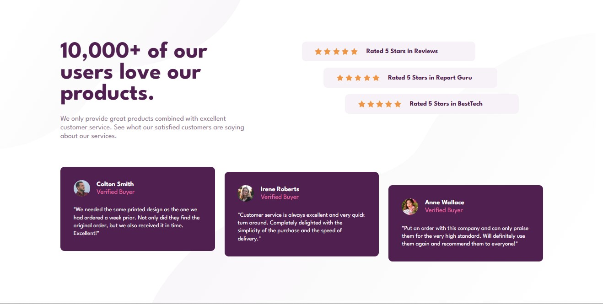

# Frontend Mentor - Social proof section solution

This is a solution to the [Social proof section challenge on Frontend Mentor](https://www.frontendmentor.io/challenges/social-proof-section-6e0qTv_bA). Frontend Mentor challenges help you improve your coding skills by building realistic projects.

## Table of contents

- [Overview](#overview)
  - [The challenge](#the-challenge)
  - [Screenshot](#screenshot)
- [My process](#my-process)
  - [Built with](#built-with)
  - [What I learned](#what-i-learned)
  - [Useful resources](#useful-resources)
- [Author](#author)

## Overview

### The challenge

Users should be able to:

- View the optimal layout for the section depending on their device's screen size

### Screenshot



## My process

### Built with

- Semantic HTML5 markup
- CSS custom properties
- Flexbox

### What I learned

I learned that I can put more than one value in background-image and background-position to put more than one image and position it and here how I used It.

```css
body {
  background-image: url(image place), url(image place);
  background-position: The place of your first "background", The place of your
      second "background";
}
```

### Useful resources

- [Example resource 1](https://developer.mozilla.org/en-US/docs/Web/CSS/background-position) - This helped me for background-position and that helped me to know that you can put two positions for two backgrounds.

## Author

- Frontend Mentor - [@MohamedAtTop](https://www.frontendmentor.io/profile/MohamedAtTop)
